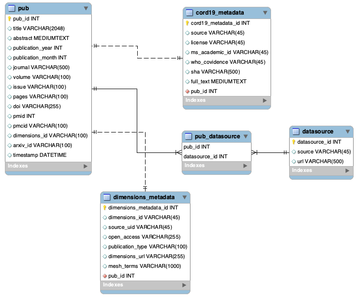

# cwts_covid

This repository contains the code [CWTS](https://www.cwts.nl) uses to create internal databases to study scientific literature on COVID-19. This code is provided as is for anyone who would like to replicate or expand upon it.

The code in this repository allows you to do the following steps:

* Take published lists of scientific publications on COVID-19 and create a relational database with them.
* Query the Dimensions and Altmetrics APIs to get more data on these publications (you will need to use your own API keys for this).
* Do some basic plotting of this data.

This workflow can be illustrated as follows:


## Data sources

For the moment, we consider publications from the following sources:

* [CORD19](https://pages.semanticscholar.org/coronavirus-research);
* [Dimensions](https://docs.google.com/spreadsheets/d/1-kTZJZ1GAhJ2m4GAIhw1ZdlgO46JpvX0ZQa232VWRmw/edit#gid=2034285255);
* [WHO](https://www.who.int/emergencies/diseases/novel-coronavirus-2019/global-research-on-novel-coronavirus-2019-ncov).

You will need to download these datasets and add them to a local folder in order to process them. We assume that you will have a local copy of the whole CORD19 dataset, and a `csv` file with publication metadata for Dimensions and WHO. Previous releases of the Dimensions and WHO lists can be found in the [datasets_input](datasets_input) folder. Please also see the notebooks below for more details. 

*In the future, we might expand to more sources.*

## Steps

### Create database

The relational schema we use to consolidate the data sources mentioned above is available as a [SQL script](datasets_input/SQL_database_schema/projectdb_covid_schema.sql) (working at least on MySQL).



You can use the [Notebook_1_SQL_database](Notebook_1_SQL_database.ipynb) notebook to populate this database. This notebook allows you to insert data into a MySQL instance of your choice, where an empty database is assumed to exist with the above-mentioned schema. Alternatively, it allows you to export the relational data to Pandas tables.

#### An explanation on tables and identifiers

* The `pub` table contains publications from all data sources. If you would like to work with publications coming exclusively from one data source, join it with the `datasource` table via the `pub_datasource` table. 
* The primary keys of all tables (`pub_id`, `covid19_mtadata_id`, `who_metadata_id`, `dimensions_metadata_id`, `datasource_id`) are not stable and are only internally consistent: if you create different versions of the database, they will likely differ.
* In order to work with Dimensions and Altmetrics data, *publication identifiers* should be used. Please give preference to DOIs, then to PMIDs, then to PMCIDs, then arXiv IDs. 
* We removed publications which had no known identifier among these four options. Most of these, at the moment, only have Semantic Scholar IDs. We might integrate those in a future update.
* The `metadata` tables contain fields which are specific to a datasource, and we considered potentially useful. They are only available for publications coming from that datasource.

### Query Dimensions and Altmetrics

You can then query [Dimensions](https://docs.dimensions.ai/dsl) and [Altmetrics](https://api.altmetric.com) APIs using your own keys, using the [Notebook_2_API_queries](Notebook_2_API_queries.ipynb) notebook. You can request access as a researcher here: https://www.dimensions.ai/scientometric-research.

### Data analysis

Using the [Notebook_3_metadata_overview](Notebook_3_metadata_overview.ipynb) and [Notebook_4_API_data_overview](Notebook_4_API_data_overview.ipynb) notebooks, you can get an overview of some of the resulting metadata and data.

### Replication of paper findings

Finally, there are three notebooks to help replicate at least part of the analysis in the accompanying paper **(CITE preprint here)**:
* [Notebook_CORD-19_1_overview](Notebook_CORD-19_1_overview.ipynb) contains the metadata overview of CORD-19.
* [Notebook_CORD-19_2_text_analysis](Notebook_CORD-19_2_text_analysis.ipynb) contains the topic modelling analysis, including its use to qualify citation network clusters.
* [Notebook_CORD-19_3_network_analysis](Notebook_CORD-19_3_network_analysis.ipynb) contains an alternative way to perform a citation network analysis, focused on the bibliographic coupling network of CORD-19 papers. Results of this analysis are comparable to what is reported in the paper.

The two citation network clustering solutions discussed in the paper, using both CORD-19 and external references, is also provided as a [separate file](datasets_input/paper_CORD19_supporting_materials/clustering_04042020.csv). These results are generated using [cluster.py](cluster.py). This may require installation of the development version of [`python-igraph`](https://github.com/igraph/python-igraph), until the upcoming release (0.8.1) is out. We therefore also include the actual clustering results themselves.

Some steps in the analyses are not included here since they require proprietary data. They can be replicated by getting access to the data (see above) and following the steps detailed in the paper. 

## How to give feedback

Please open an issue, or propose changes using a Pull Request.

## How to cite

```
@article {Colavizza2020.04.20.046144,
    author = {Colavizza, Giovanni and Costas, Rodrigo and Traag, Vincent A. and van Eck, Nees Jan and van Leeuwen, Thed and Waltman, Ludo},
    title = {A scientometric overview of CORD-19},
    elocation-id = {2020.04.20.046144},
    year = {2020},
    doi = {10.1101/2020.04.20.046144},
    publisher = {Cold Spring Harbor Laboratory},
    URL = {https://www.biorxiv.org/content/early/2020/04/20/2020.04.20.046144},
    eprint = {https://www.biorxiv.org/content/early/2020/04/20/2020.04.20.046144.full.pdf},
    journal = {bioRxiv}
}
```

## Acknowledgements

We would like to thank Digital Science (Dimensions, Altmetrics) for their support and for making all their data available to us.
